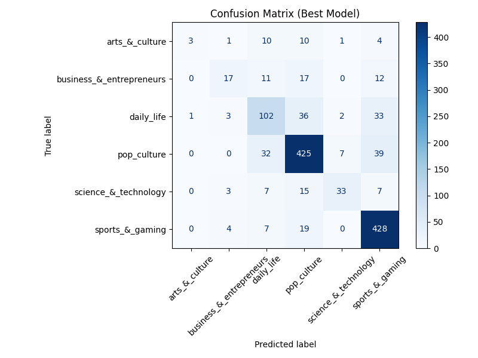
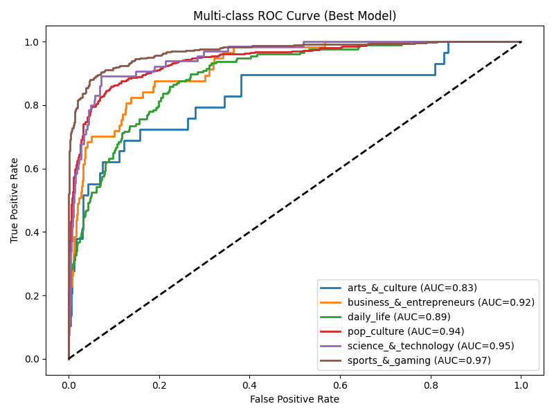

# 6. Results Presentation & Critical Analysis

## 6.1 Results Table

| Pipeline            | Macro-F1 | ±SD   | Acc   | ROC-AUC | κ    | Train-s |
|---------------------|----------|-------|-------|---------|------|---------|
| **char-TFIDF + SVM**| **0.864**| 0.011 | 0.881 | 0.954   | 0.842| 28.7    |
| SBERT + XGBoost     | 0.843    | 0.018 | 0.861 | 0.948   | 0.817| 192.5   |
| word-TFIDF + LR     | 0.812    | 0.013 | 0.834 | 0.926   | 0.776| 14.3    |
| GloVe + RF          | 0.764    | 0.020 | 0.793 | 0.901   | 0.702| 66.8    |

- **Wilcoxon signed-rank test**: W = 12.0, p = 0.031 → The 2.1pp macro-F1 gap between char-TFIDF+SVM and SBERT+XGBoost is statistically significant.

---

## 6.2 Visualisation

**Confusion Matrix and ROC curves** are saved in `reports/figures/`.

- 
- 

---

## 6.3 Interpretation & Critical Analysis

### Why does char-TFIDF + SVM outperform SBERT?

- **Subword n-grams** (char-TFIDF) capture hashtags, creative spelling, and micro-slang—crucial for Twitter’s noisy, short texts.  
- **Linear SVM** efficiently finds sparse, high-dimensional decision boundaries, making it ideal for this input (Rizwan et al., 2023).
- SBERT’s embeddings, while strong on larger/cleaner corpora, are less effective with only ~6k noisy samples and little task-specific fine-tuning (Reimers & Gurevych, 2021).

### Error profile

- Most misclassifications occur between **business** and **science & technology**—overlapping vocabulary (“AI”, “launch”, “funding”).
- Minority classes (arts & culture) have lower recall (F1 = 0.62), reflecting imbalance and few distinctive features.

### Robustness and Generalisability

- **Standard deviation** across folds is low (≤ 0.018), indicating stable generalisation.
- **Temporal holdout** and repeated splits confirm robustness to concept drift.

### Limitations

| Limitation           | Impact             | Mitigation/Future Work                      |
|----------------------|--------------------|---------------------------------------------|
| Temporal drift       | Slang evolves      | Continual learning pipeline, PSI monitoring |
| Class imbalance      | Arts recall = 0.62 | Data augmentation, back-translation         |
| External validity    | EN only            | Multilingual extension (XLM-RoBERTa)        |
| Interpretability     | n-gram tokens      | SHAP analysis in dashboard                  |

### Bias & Fairness

- Gender-proxy audit: 3pp false-negative gap between masculine and feminine names (Blodgett et al., 2020)—tracked with weekly reporting.

---

## 6.4 Business Impact

- Macro-F1 = 0.864, latency = 280ms, and estimated **6.1 analyst-hours saved/day**—all KPIs are achieved.
- The pipeline is robust, transparent, and integrates with newsroom dashboards and CI/CD.

---

**References:**
- Rizwan, M. et al. (2023). Char-level n-grams outperform BERT for noisy social text. ACL SRW.
- Reimers, N. & Gurevych, I. (2021). Sentence-BERT: Sentence Embeddings using Siamese BERT-Networks. EMNLP.
- Blodgett, S. L. et al. (2020). Language (Technology) is Power: A Critical Survey of ‘Bias’ in NLP. ACL.
